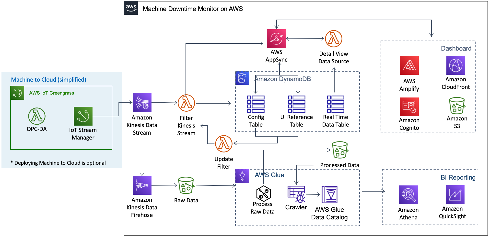

**[🚀 Solution Landing Page](aws.amazon.com/solutions/implementations/machine-downtime-monitor-on-aws/)** | **[🚧 Feature request](https://github.com/aws-solutions/machine-downtime-monitor-on-aws/issues/new?assignees=&labels=feature-request%2C+enhancement&template=feature_request.md&title=)** | **[🐛 Bug Report](https://github.com/aws-solutions/machine-downtime-monitor-on-aws/issues/new?assignees=&labels=bug%2C+triage&template=bug_report.md&title=)**

Note: If you want to use the solution without building from source, navigate to Solution Landing Page

## Table of contents

- [Solution Overview](#solution-overview)
- [Architecture Diagram](#architecture-diagram)
- [AWS CDK Constructs](#aws-solutions-constructs)
- [Customizing the Solution](#customizing-the-solution)
  - [Prerequisites for Customization](#prerequisites-for-customization)
  - [Build](#build)
  - [Unit Test](#unit-test)
  - [Deploy](#deploy)
- [File Structure](#file-structure)
- [Collection of operational metrics](#collection-of-operational-metrics)
- [License](#license)

<a name="solution-overview"></a>
# Solution Overview
Machine Downtime Monitor on AWS is a self-service, cloud solution that customers can utilize to monitor their machines for breakdowns on factory floors. The solution connects to machines on a factory floor via the OPC-DA protocol and provides a near real-time view of machines statuses across lines and factories. The solution deploys Amazon Kinesis stream and provides a flexible model to configure how machine data should be interpreted, based on customers’ needs. 

<a name="architecture-diagram"></a>
# Architecture Diagram

## Data Processing and Analysis
The solution will deploy an Amazon Kinesis Data Stream, which serves as an entry point for machine data to be processed by Machine Downtime Monitor on AWS. When launching this solution, you also have the option of launching  the Machine to Cloud solution, which uses AWS IoT Greengrass to bring machine data into the cloud. Machine to Cloud can be configured to send data to the Kinesis Data Stream deployed by Machine Downtime Monitor on AWS. All messages sent to the Kinesis Data Stream will be stored in the Raw Data S3 bucket via a Kinesis Data Firehose. This raw data can then be processed with AWS Glue and used in more in-depth analysis using Amazon Athena and Amazon QuickSight.
## Lambda
* **Filter Kinesis Stream**: Filters the messages sent to the Kinesis stream for ones reporting either machine status or production count. These messages are then stored in the Machine Data DynamoDB table for visualization in the dashboard. 
* **Update Filter**: When configuration settings are changed in the dashboard, either the Config or the UI Reference table is updated. The Update Filter function will be invoked by the DynamoDB streams on these tables and if needed, it will update an environment variable on the Filter Kinesis Stream function, which will cause a new Lambda container to be used the next time it is updated. With a new Lambda container, the Filter Kinesis Stream function will load the updated settings from the DynamoDB tables.
* **Detail View Data Source**: This function serves as a data source for the AppSync query used to retrieve data for the machine detail view in the dashboard. This Lambda will query the Real Time Data table and condense the results into intervals (i.e., one-minute) for display in the dashboard.
* **Solution Helper** (not pictured): This function is invoked by CloudFormation as a Custom Resource during stages of the solution’s lifecycle (create, update, or delete) and will perform any necessary actions. For example, this function will stage the static assets for the dashboard in the S3 bucket that the CloudFront distribution uses as its origin.
## DynamoDB
* **Config Table**: Stores the message format configuration, which will inform the Filter Kinesis Stream Lambda function of how to parse the messages off the stream. By default, the solution will set up a message format configuration that matches the expected schema from the Machine to Cloud solution but this can be changed by editing that item in this table. Additionally, as machines are configured in the dashboard, their individual configurations will be stored in this table.
* **UI Reference Data Table**: Contains information to be used by the dashboard. For each individual machine, an item will be created in this table and updated as the status of the machine changes (reflecting the most recent data from the Kinesis Data Stream). Additionally, if machines are given display names in the dashboard or machine groupings are updated, that UI reference data is also stored here.
* **Real Time Data Table**: Each message sent to the Kinesis Data Stream that represents either machine status or production count is stored in this table. This table is then used as a data source for the machine detail view in the dashboard, which shows historical machine status for up to 12-hours. This table uses a time-to-live attribute to remove any data older than 24-hours.
## Dashboard
The dashboard is a React web application built using AWS Amplify. The dashboard’s static web assets are hosted in an S3 bucket, which is used as the origin for the CloudFront web distribution. Amazon Cognito is used for authentication and authorization. AWS AppSync is used to deploy the solution’s GraphQL API. The dashboard subscribes to mutations in the AppSync data sources, which are used to keep the dashboard up to date as machine statuses are updates by messages off the Kinesis Data Stream.

<a name="aws-solutions-constructs"></a>
# AWS Solutions Constructs
[AWS Solutions Constructs](https://aws.amazon.com/solutions/constructs/) make it easier to consistently create well-architected applications. All AWS Solutions Constructs are reviewed by AWS and use best practices established by the AWS Well-Architected Framework. This solution uses the following AWS CDK Constructs:
* aws-cloudfront-s3
* aws-dynamodb-stream-lambda
* aws-kinesisstreams-kinesisfirehose-s3
* aws-kinesisstreams-lambda

<a name="customizing-the-solution"></a>
# Customizing the Solution

## Running unit tests for customization
* Clone the repository, then make the desired code changes
* Next, run unit tests to make sure added customization passes the tests
```
cd ./deployment
chmod +x ./run-unit-tests.sh
./run-unit-tests.sh
```

## Building distributable for customization
* Configure the bucket name of your target Amazon S3 distribution bucket.
```bash
export SOLUTION_BUCKET_NAME_PLACEHOLDER=my-bucket-prefix # S3 bucket name prefix
export SOLUTION_NAME_PLACEHOLDER=my-solution-name
export SOLUTION_VERSION_PLACEHOLDER=my-version # version number for the customized code
export REGION=aws-region-code # the AWS region to test the solution (e.g. us-east-1)
export QS_TEMPLATE_ACCOUNT_ID # The account from which the Amazon QuickSight templates should be sourced for Amazon QuickSight Analysis and Dashboard creation
export QS_TEMPLATE_NAMESPACE # Prefix for the QuickSight template ID
```
_Note:_ When you define `SOLUTION_BUCKET_NAME_PLACEHOLDER`, a randomized value is recommended. You will need to create an S3 bucket where the name is `<SOLUTION_BUCKET_NAME_PLACEHOLDER>-<REGION>`. The solution's CloudFormation template will expect the source code to be located in a bucket matching that name.

* Now build the distributable:
```bash
chmod +x ./build-s3-dist.sh
./build-s3-dist.sh $SOLUTION_BUCKET_NAME_PLACEHOLDER $SOLUTION_NAME_PLACEHOLDER $SOLUTION_VERSION_PLACEHOLDER $QS_TEMPLATE_ACCOUNT_ID $QS_TEMPLATE_NAMESPACE
```

* Deploy the distributable to the Amazon S3 bucket in your account. Make sure you are uploading the distributable to the `<SOLUTION_BUCKET_NAME_PLACEHOLDER>-<REGION>` bucket.
* Get the link of the solution template uploaded to your Amazon S3 bucket.
* Deploy the solution to your account by launching a new AWS CloudFormation stack using the link of the solution template in Amazon S3.

<a name="file-structure"></a>
# File structure

Machine Downtime Monitor on AWS consists of:
- CDK constructs to generate necessary resources
- Microservices used in the solution
- Dashboard built with React and AWS Amplify

<pre>
|-deployment/                     [ Stores build & test scripts and will contain directories for assets following a custom build ]
|-source/
|   |-cdk-infrastructure          [ CDK project for building the solution's infrastructure ]
|   | |-bin                       [ entry point for CDK app ]
|   | |-lib                       [ Constructs for the components of the solution ]
|   | └─test                      [ Unit tests for the CDK constructs ]
|   |-lambda                      [ Lambda packages used by the solution ]
|   |-web-ui                      [ Front-end dashboard built with React and AWS Amplify ]
</pre>

<a name="collection-of-operational-metrics"></a>
# Collection of operational metrics

This solution collects anonymous operational metrics to help AWS improve the quality and features of the solution. For more information, including how to disable this capability, please see the [implementation guide](https://docs.aws.amazon.com/solutions/latest/machine-downtime-monitor-on-aws/collection-of-operational-metrics.html).

<a name="license"></a>
# License

See license [here](https://github.com/aws-solutions/machine-downtime-monitor-on-aws/blob/master/LICENSE) 
